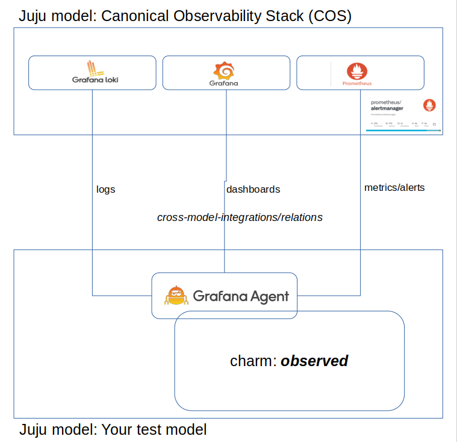

# observed

## Description

This charm demonstrates how to integrate with [Canonical Observability Stack (COS)](https://charmhub.io/cos-lite).

It ships a dashboard, a prometheus alert rule and a loki alert rule.

## Usage

Deploy the [Canonical Observability Stack (COS)](https://charmhub.io/cos-lite) and offer the three needed integrations. This guide does not cover setting up COS lite but leaves that up to the reader.



Lets say your url:s from the COS stack are available as:

    admin/cos.cos-grafana-dashboard
    admin/admin/cos.prometheus-remote
    admin/admin/cos.cos-loki-logging
    
Then deploy this charm with the grafana-agent as a subordinate in your own test model like this:

    juju depoy ./observed.charm
    juju deploy grafana-agent

Now, relate with the COS offers you have in your test model.

    juju relate grafana-agent cos.cos-grafana-dashboard
    
    juju relate grafana-agent cos.prometheus-remote
    
    juju relate grafana-agent acos.cos-loki-logging

Juju will now take care of sending dashboards, alert-rules & loki rules to COS and you can access them in COS grafana dashboard.


## Dashboard with juju topoligy.

When Juju ships the supplied [dashboard](src/grafana_dashboards/microsample_dashboard.json), variables from the juju topolgy are injected by the grafana-agent library such that they can be used directly in the dashboard json.

For example in the loki query:

    ```"expr": "{juju_application=\"$juju_application\", juju_unit=~\"$juju_unit\"} |~ \".* 404 .*\""```

Read about [Juju topology](https://discourse.charmhub.io/t/juju-topology-labels/8874) for how to extend this to your own charms.

## Alert rules examples

The charm ships a [prometheus alert rule](src/alert_rules/prometheus/microsample_prometheus.rule) that is triggered once you have called the microsample API more than 3 times like below:

    curl http://microsample.ip:8080/api/info

The charm shipps a Loki alert rule, that is triggered if API is called incorrecty which causes Loki to see a 404 code in the logs) 

    curl http://microsample.ip:8080/api/XXX

## Alertmanager examples

There is 4 different examples of [alertmanager configurations](src/alertmanager_configs/) that shows how to intergrate pagerduty and slack with alertmanager.
If other providers or configuration is needed, more information can be found at [prometheus documentation](https://prometheus.io/docs/alerting/latest/configuration/) site.

Inject configuration file with juju using following command:

    juju config alertmanager config_file=@/path/to/file

To show or check current configuration:

    juju run-action alertmanager/0 show-config
    juju run-action alertmanager/0 check-config

### Development process

This charm is developed following this guide: https://charmhub.io/topics/canonical-observability-stack/tutorials/instrumenting-machine-charms

The general steps are:

1. Initialize your charm you wish to integrate.
   
    ```charmcraft init --profile machine```

2. Fetch the grafana-agent libs with charmcraft:

    ```charmcraft fetch-lib charms.grafana_agent.v0.cos_agent```

3. Create directories for grafana dashboards, prometheus alert rules & loki rules. We will reference those in the code.
    ```mkdir -p ./src/alert_rules/loki ./src/alert_rules/prometheus ./src/grafana_dashboards```

4. Add to metadata.yaml

    ```
    provides:
      cos-agent:
        interface: cos_agent
    ```

5. Then in your charm.py

    ```
    def __init__(self, *args):
            super().__init__(*args)
            
            # Define the data to send to grafana-agent
            self._grafana_agent = COSAgentProvider(
                self, metrics_endpoints=[
                    {"path": "/metrics", "port": self.config.get('port')},
                ],
                metrics_rules_dir="./src/alert_rules/prometheus",
                logs_rules_dir="./src/alert_rules/loki"
    ```
