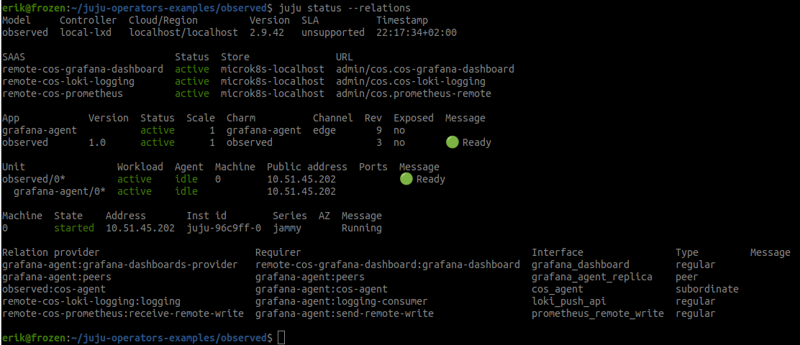
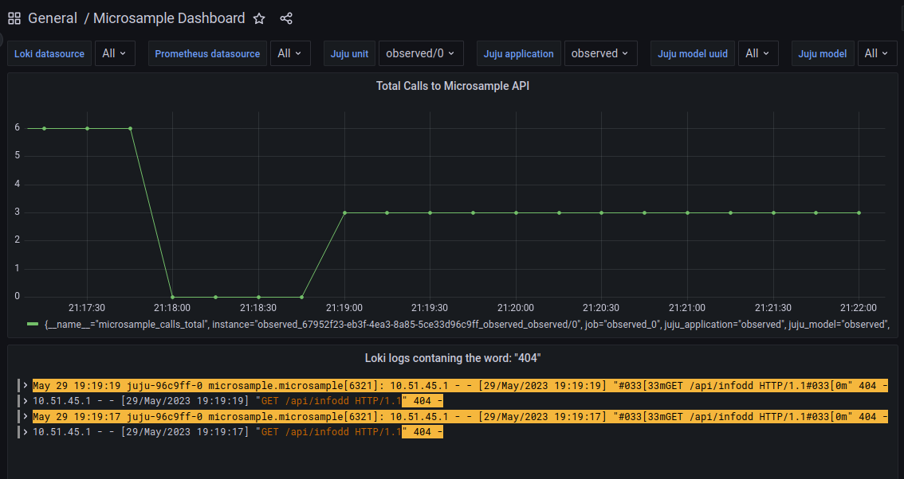

# observed

## Description

This charm demonstrates how to integrate with COS observability stack.

The general steps for a clean start are:


1. Initialize your charm you wish to integrate.
   
    ```charmcraft init --profile machine```

2. Fetch the grafana-agent libs with charmcraft:

    ```charmcraft fetch-lib charms.grafana_agent.v0.cos_agent```

3. Create directories for grafana dashboards, prometheus alert rules & loki rules. We will reference those in the code.
    ```mkdir -p ./src/alert_rules/loki ./src/alert_rules/prometheus ./src/grafana_dashboards```

4. Add to metadata.yaml

    ```
    provides:
      cos-agent:
        interface: cos_agent
    ```

5. Then in your charm.py

```
 def __init__(self, *args):
        super().__init__(*args)
        
        # Define the data to send to grafana-agent
        self._grafana_agent = COSAgentProvider(
            self, metrics_endpoints=[
                {"path": "/metrics", "port": self.config.get('port')},
            ],
            metrics_rules_dir="./src/alert_rules/prometheus",
            logs_rules_dir="./src/alert_rules/loki"
```

Full guide here: https://charmhub.io/topics/canonical-observability-stack/tutorials/instrumenting-machine-charms

## Usage

First, make sure you have a COS stack deployed and operational which offers the three needed integrations. Lets say your url:s are available as:

    admin/cos.cos-grafana-dashboard
    admin/admin/cos.prometheus-remote
    admin/admin/cos.cos-loki-logging
    

Then deploy this charm with the grafana-agent as a subordinate like this:

    juju depoy ./observed.charm
    juju deploy grafana-agent # You might need to add --channel edge.

Now, relate with the COS offers you have in your model

    juju relate grafana-agent cos.cos-grafana-dashboard
    
    juju relate grafana-agent cos.prometheus-remote
    
    juju relate grafana-agent acos.cos-loki-logging

Juju will now take care of sending dashboards, alert-rules & loki rules to COS and you can access them in COS grafana dashboard.





## Customize dashboards etc.

Read here: https://discourse.charmhub.io/t/juju-topology-labels/8874

## Relations

    Relate this to grafana-agent

## Contributing

Place a PR